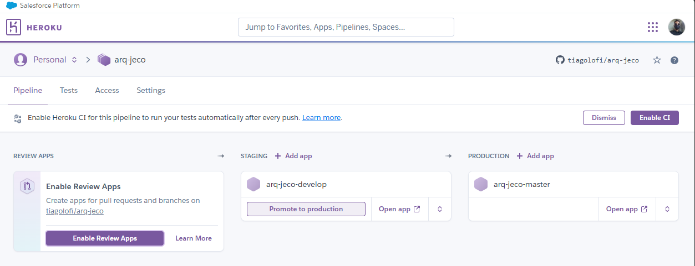

# arq-jeco
Arquitetura Jejequiana para Desenvolvimento de Software

## Devops

### Heroku Pipelines

### CI/CD
A branch "___develop___" abrange o desenvolvimento da aplicação, bem como os testes de integração da mesma. Sendo vinculada à uma aplicação heroku específica, sem prejuízo ao cliente/usuário.

A branch "___master___" deverá conter uma aplicação completa e funcional, utilizando deploy automático assim que houver o merge request a partir da branch "___develop___".

_Features_ (novas funcionalidades) deverão ser adicionadas a partir da última versão funcional do projeto e identificadas como "_feature/novaFuncao_"

Para o caso de bibliotecas e microsserviços, deverá ser utilizado o padrão "**Major-Minor-Patch**" para as releases.

### Ambientes de Integração Contínua

## Banco de Dados

### MongoDB Atlas

## Codificação

### Flask e PyMongo

### Design Pattern - Transaction Script

#### Estrutura de Pastas
```
- app.py
- Procfile
- requirements.txt
- static/
- templates/
- src or name-project/
  - testes/
  - services/
      - __init__.py
      - name service endpoint.py
  - utils/
      - __init__.py
  - models/
      - __init__.py
      - name object bussiness.py
  - database/
      - __init__.py
      - auth.py
      - insert.py
      - read.py
      - delete.py
      - update.py
 ```
