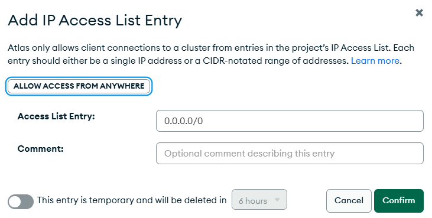

# arq-jeco
Arquitetura Jejequiana para Desenvolvimento de Software em Python [EM DESENVOLVIMENTO]

## Ideias
- criar um serviço de webhook
- criar um sistema de feedback
- criar um sistema de almoxarifado
- criar um sistema de controle de pedidos/balcão para lanchonete

## Devops

### Heroku Pipelines

São estruturas que agrupam aplicações de um mesmo projeto, fornecendo uma visão "___staging x production___" que favorece no desenvolvimento, na aplicação de testes e entrega de uma aplicação funcional.

### CI/CD
A branch "___develop___" abrange o desenvolvimento da aplicação, bem como os testes de integração da mesma. Sendo vinculada à uma aplicação heroku específica, sem prejuízo ao cliente/usuário.

A branch "___master___" deverá conter uma aplicação completa e funcional, utilizando deploy automático assim que houver o merge request a partir da branch "___develop___".

_Features_ (novas funcionalidades) deverão ser adicionadas a partir da última versão funcional do projeto e identificadas como "_feature/novaFuncao_"

Para o caso de bibliotecas e microsserviços, deverá ser utilizado o padrão "**Major-Minor-Patch**" para as releases.

### Configuração do ambiente de integração contínua
> Aplicação (Develop) -> Deploy -> Automatic deploys

[]()
[]()

## Banco de Dados

### MongoDB Atlas + PyMongo (wrapper mongo)

> "_An integrated suite of cloud database and data services to accelerate and simplify how you build with data._"

1. Criação de um projeto

[]()

2. Configuração de um Cluster M0 Free

[]()

3. Criação de um usuário e definição de privilégios

[]()

**OBS**: salvar as secrets no arquivo _.env_

4. Configuração de IP Access (Network Access)

[]()

## Codificação

### Flask

### Design Pattern - Transaction Script


### Outras implementações
**Logging** - Submódulo a nível de modelo devem implementar uma interface de logging;

**Hashing** - Submódulo voltado para criação de hashs irreversíveis;

**Exceptions** - Submódulo devem implementar suas próprias regras de exceção com o tratamento da exception. A aplicação se encarregará de sanitizar os erros apenas de nível negocial;

**Utilitários** - Submódulos que implementam funções ou classes auxiliares.

#### Estrutura de Pastas
```
- app.py
- Procfile
- .env
- requirements.txt
- testes/
- static/
- templates/
- src or name-project/
  - hashing/
  - utils/
  - logs/
  - exceptions/
  - services/
      - name service endpoint.py
  - models/
      - name object bussiness.py
  - database/
 ```
## TODO

arquivo run.sh
testes
arquivo de logs
